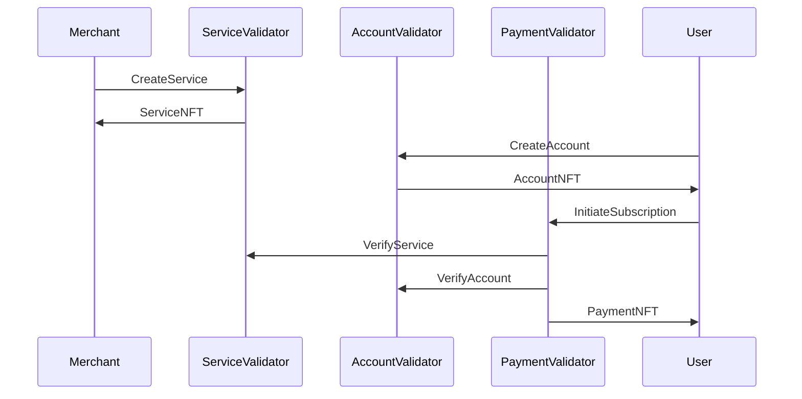

# Payment Subscription Smart Contract: Test Documentation

## Overview

This document presents comprehensive evidence of the successful implementation
and testing of the Payment Subscription Smart Contract Maestro API endpoints addressing the effortless
management of recurring payments.

It addresses five key endpoints:

1. **createService:** Allows the Merchant to Create a new Service with Pre-defined configurations by minting a unique Merchant NFT. 
2. **createUserAccount:** Allows the Subscriber to Create a new Account in the Subscription system with pre-defined configurations by minting a unique Account NFT.
3. **initSubscription:** Creates a new subscription for the Subscriber by locking funds in the Smart Contract and Minting a unique PAynemt NFT.
4. **withdrawFees:**  Lets the Merchant unlock subscription funds from the Smart Contract
in repect to the specified subscription start and end dates.
5. **unsubscribe:** A subscriber can securely unsubscribes from a particular service.

Each section provides detailed insights into the functionality, security, and
usability of the smart contract, demonstrating its readiness for real-world
application.

Our rigorous testing suite demonstrates the contract's ability to manage
recurring payments effectively and with ease.

### Test Suite Details

The test suite for the Payment Subscription Smart Contract consists of five
critical test cases, each designed to verify specific aspects of the contract's
functionality.

A successful API integration call results in a `cbor_hex` and a `tx_hash` where afterwards, a user can sign and submit.

### Test Environment & Prerequisites

- **Environment:** Preprod Maestro API (`https://preprod.gomaestro-api.org`).

- **Tools:** `cURL` in Terminal; Postman (optional).
- **Credentials:** Valid `api-key` in header; at least two funded test wallet address in `MERCHANT_ADDRESS` and `SUBSCRIBER_ADDRESS`.

- Variables:

   ```ts
      export MAESTRO_API_KEY="<your_api_key>"
      export NETWORK=Preprod 
      export MERCHANT_ADDRESS="<addr_test...>"
      export SUBSCRIBER_ADDRESS="<addr_test...>"


### API Endpoints
---

| User          | Endpoint                                          | Method | Description                         |
|---------------|---------------------------------------------------|--------|-------------------------------------|
| Merchant      | `/v1/contracts/subscription/createService`        | POST   | Create a new Service                |
| Subscriber    | `/v1/contracts/subscription/createUserAccount`    | POST   | Create a new Account                |
| Subscriber    | `/v1/contracts/subscription/initSubscription`     | POST   | Initiate a new Subscription Service |
| Merchant      | `/v1/contracts/subscription/withdrawFees`         | POST   | Withdraw Subscription Fees          |
| Subscriber    | `/v1/contracts/subscription/unsubscribe`          | POST   | Cancel a Subscription Service       |


### Test Suite Summary
---

| Test ID  | Scenario                         | Endpoint               | Expected Outcome                  |
|----------|----------------------------------|------------------------|-----------------------------------|
| PS-01    | Happy Path Create Service        | `/createService`       | JSON with `cbor_hex`, `tx_hash`   |
| PS-02    | Happy Path Create Account        | `/createUserAccount`   | JSON with `cbor_hex`, `tx_hash`   | 
| PS-03    | Happy Path Init Subscription     | `/initSubscription`    | JSON with `cbor_hex`, `tx_hash`   | 
| PS-04    | Error Invalid Service/Account    | `/initSubscription`    | Error 400 Unexpected token        | 
| PS-05    | Happy Path Withdraw Fees         | `/withdrawFees`        | JSON with `cbor_hex`, `tx_hash`   | 
| PS-06    | Happy Path unsubscribe           | `/unsubscribe`         | JSON with `cbor_hex`, `tx_hash`   | 

## 1. Service

Below is the test results for the Service Validator. 

This endpoint enables management of a service.


### Detailed Test Analysis

#### PS-01: Happy Path Create Service

---

```sh

curl --location 'https://preprod.gomaestro-api.org/v1/contracts/subscription/createService' \
--header 'Content-Type: application/json' \
--header 'api-key: ${API_KEY}' \
--data '{
    "merchant_address": "addr_test1qzngfvxfk2grdas3daahzku733639z0lacyergaerf382rcungt5wwjcw2ef63324vchv7k9ryds4030h3hfw2us2vsqd48fdq",
    "selected_out_ref": {
        "tx_hash": "9bae7f98ee3c363f7d8dd47e57b5458d272e4d0ed1c3f21d14662f42aac31776",
        "output_index": 2
    },
    "service_fee_policyid": "",
    "service_fee_assetname": "",
    "service_fee": 1000,
    "penalty_fee_policyid": "",
    "penalty_fee_assetname": "",
    "penalty_fee": 10,
    "interval_length": 2592000000,
    "num_intervals": 1,
    "is_active": true
}'
```

#### Test Results

```sh
{"cbor_hex":"84a800d90102818258209bae7f98ee3c363f7d8dd47e57b5458d272e4d0ed1c3f21d14662f42aac3177602018382583900a684b0c9b29036f6116f7b715b9e8c751289ffee0991a3b91a62750f1c9a17473a5872b29d462aab31767ac5191b0abe2fbc6e972b905320821a001344eea1581c415ec9c6dd4d4b21af1e65959eb18bee2e8873b05f74468c6db9ff48a15820000de14002835cfbba05b4500fdcb1445d05191362205826982e6da0ec84065b01a300581d70415ec9c6dd4d4b21af1e65959eb18bee2e8873b05f74468c6db9ff4801821a001355c4a1581c415ec9c6dd4d4b21af1e65959eb18bee2e8873b05f74468c6db9ff48a15820000643b002835cfbba05b4500fdcb1445d05191362205826982e6da0ec84065b01028201d81855d8799f40401903e840400a1a9a7ec80001d87a80ff82583900a684b0c9b29036f6116f7b715b9e8c751289ffee0991a3b91a62750f1c9a17473a5872b29d462aab31767ac5191b0abe2fbc6e972b9053201b0000000138acd41a021a0004d44409a1581c415ec9c6dd4d4b21af1e65959eb18bee2e8873b05f74468c6db9ff48a25820000643b002835cfbba05b4500fdcb1445d05191362205826982e6da0ec84065b015820000de14002835cfbba05b4500fdcb1445d05191362205826982e6da0ec84065b010b5820eab168d971b41c12617bfb2c2bc7b3b9832f9de5a41072b3e70cc577af98b8c30dd90102818258209bae7f98ee3c363f7d8dd47e57b5458d272e4d0ed1c3f21d14662f42aac31776021082583900a684b0c9b29036f6116f7b715b9e8c751289ffee0991a3b91a62750f1c9a17473a5872b29d462aab31767ac5191b0abe2fbc6e972b9053201b00000001388bf7d0111a004c4b40a20581840100d8799f0001ff821a00021cac1a02fad59307d9010281590a35590a3201010029800aba2aba1aba0aab9faab9eaab9dab9a4888888966003300130033754011370e90004dd2a4001370e90014896600200314bd7044cc01cc010c020004cc008008c0240050064dc3a40089111114c004c03401a601800d222598008014530103d87a80008acc004c0200062600e6601c601e00497ae08cc00400e6020005337000029000a0064028806a44b30013007300a375400513232323232323232329800992cc004c0540062b3001337129002180a000c5a2601e6028002809a2c80b0dd5180b800cdd7180b804cdd7180b8044dd6980b803cdd7180b8034dd7180b802cdd6980b8024dd6980b801cdd6980b8012444444444b3001302100a809c5901e0c05c004c058004c054004c050004c04c004c048004c044004c040004c02cdd50014590094c00800a44646600200200644b30010018a6103d87a8000899192cc004cdc8802800c56600266e3c0140062601466022601e00497ae08a60103d87a80004035133004004301300340346eb8c034004c04000500e48cc896600260026eb4c03cc040c040c030dd5001c56600266e252000375a601e6020602060206020602060186ea800e2b30013001375a601e60206020602060206020602060186ea800e2b300130010028acc004cdc4801241900313006300b3754601e6020602060206020602060206020602060186ea800e294100a452820148a50402914a08052294100a1bad300d300e300e300e300e300e300e300e300a37540026e2120004888888a6002602600f301330140079802802c8c0100064464b3001300d3012375400314bd6f7b63044dd5980b18099baa00140446600800400291111192cc004c048006264b300130133016375400f13232332259800980f801c4cc88cc8a60026eacc088c08cc08c00a6601a6eb0c08801000644530014800290204cdc500099b8b0023726006b8c4dd698111811801a4444b3001301f3022375400713233229800cc00400a00348904000643b00040159800801400691104000de14000401533014375860520120089112cc004c094c0a0dd5000c4c8c8cc8966002604a60586ea80062664466046002264b300130340018992cc004c0acdd69818800c4c8c966002606e003133223322598008054566002605001315980099baf374e60480186e9ccc0e530101400033039375204297ae08acc004cdc79bae30360070118acc00566002b30013371e00402313371e00202114a081aa29462b30013371e00402113371e00202314a081a9035456600260626eb4c0dc012260626eb4c0dc00e29410354528206a8a5040d514a081aa29410354528206a375c60680046eb8c0d0004c0d8008c0d80062c81a0c0d8004cc07404806e2c8178c0cc0062c8188cc06c010064cdd7981818169baa30300043374a9001198179ba90174bd70181818169baa0018b20563756605c002605c605e002605c00260526ea8c0b0c0a4dd5000c590270dd718138009bad3027302800130233754604c60466ea8c098c08cdd5001c590210c084c084008dd69810000980d9baa011301b37540171640706eb4c070004dd6980e001180e000980b9baa0078b202a375c6032602c6ea80162b30013010001899199119912cc004c05c0062646464653001375a6044003375c6044009375a6044007375a604400491112cc004c09c016015164090302200130210013020001301b3754017159800980a800c4c8c8c8ca60026eb4c0880066eb8c0880126eb4c08800e6eb4c0880092222598009813802c02a2c812060440026042002604000260366ea802e2c80c901909919912cc004c060c06cdd5002466002603e60386ea80124604060420032223259800980d180f9baa0018a40011375a604660406ea800501e192cc004c068c07cdd5000c530103d87a8000899198008009bab30243021375400444b30010018a6103d87a8000899192cc004cdc8803000c56600266e3c0180062603e6604c604800497ae08a60103d87a80004089133004004302800340886eb8c088004c094005023203c33011003002919b8a488104000de140009800a4011337006e340052007800ae3091112cc004c070c07cdd500844c8ca6002604c00333010008375a604a00323026302730273027302700191813181398139813800cdd71812801244444b300130233026375400913259800981218139baa0018991919912cc004c098c0acdd500144ca6002604f300137566020605a6ea8012003007403d302798009bab3010302d37546020605a6ea8c0c0c0b4dd50054006601c00e807a660360246eb4c0c0c0c402d22259800981618179baa0018991919912cc004c0b0c0ccdd5000c4cc88cc0a8004566002017159800804c566002011159800801456600266ebcdd398118021ba7330384c0101400033038375201497ae08acc004cdd79ba63302200400a374c6607066ec0dd48082610101004bd6f7b6304566002b30013371e6eb8c0e4c0d8dd50009bae30393036375403515980099b8f375c6032606c6ea8004dd7180c981b1baa01a8acc004cdc79bae3011303637540026eb8c044c0d8dd500d44cdc79bae3012303637540026eb8c048c0d8dd500d452820688a5040d114a081a22604e00314a081a22941034452820688a5040d114a081a22941034452820683375e606e60686ea8c0dc010028c0dcc0d0dd5000c590321bab303500130353036001303500130303754606660606ea80062c81706eb8c0bcc0b0dd500145902a181698151baa302d302a375400266ebcc0b4c0a8dd5001009980618149baa001302b302837540031640986602a01a6eb4c0a80162c8128604a00260406ea80422646530013026001998080041bad30250019bae3025002488966002604260486ea800a264b300130223025375400313232332259800981218149baa0028994c004c09660026eacc038c0acdd5002400600e806a604b30013756601c60566ea8c038c0acdd5181718159baa008800cc03001d00d4cc064040dd698171817804a444b3001302a302d375400313232332259800981518189baa00189991198140008991919191919192cc00404a2b30010108acc00403e2b30010098acc004cdd79ba7302800b374e6607a9810140003303d375202297ae08acc004cdd79ba63302700b011374c6607a66ec0dd480ba610101004bd6f7b63044cdd7804181b1981e981f0039981e981f0031981e981f0029981e981f0021981e981f0019981e981f0011981e981f0009981e981f181f8009981ecc005285300103d87a8000a60103d879800040e497ae08a5040e514a081ca2941039452820728a5040e514a081c8c0f8004c0f4004c0f0004c0ec004c0e8004c0e4004c0d0dd500c19baf303530323754606a008014606a60646ea80062c8180dd598198009819981a000981980098171baa3031302e37540031640b0375c605a60546ea800a2c8140c0acc0a0dd5181598141baa0013375e605660506ea8008044c028c09cdd5000981498131baa0018b20483301300b375a605000716408c30250013020375402080f11640686eb0c074004dd6180e980f180f000980c9baa00f30183754012603400260346036002602c6ea80162c80a1014180a1baa0041149a26cac80081f5f6",
"tx_hash":"3020d5e68bc7a5bdf8129c5c2927e710aedbe265717c9b5e0237827bb345955c"}
```
## 2. Account

### Detailed Test Analysis


#### PS-02: Happy Path Create Account

---

```sh
curl --location 'https://preprod.gomaestro-api.org/v1/contracts/subscription/createUserAccount' \
--header 'Content-Type: application/json' \
--header 'api-key: ${API_KEY}' \
--data '{
    "subscriber_address": "addr_test1qpp9s0ml0z9lg8ym2ueh0jsay6dg7dj0aslx2lnlda9sukk6ryucc4hthndrvllxq584xw6r2q8hynv6sslrammpmd5srdmxus",
    "selected_out_ref": {
        "tx_hash": "e3dd79c0e578aabdac13f1f35a2ed07ad3a0e82e0e4d6eec8ee4c3a2919846c8",
        "output_index": 1
    },
    "email": "name@mail.com",
    "phone": "+254721000000"
}'
```

#### Test Results:

```sh
{"cbor_hex":"84a800d9010281825820e3dd79c0e578aabdac13f1f35a2ed07ad3a0e82e0e4d6eec8ee4c3a2919846c80101838258390042583f7f788bf41c9b573377ca1d269a8f364fec3e657e7f6f4b0e5ada19398c56ebbcda367fe6050f533b43500f724d9a843e3eef61db69821a001344eea1581c2600357194101d00684a0aefe11b463a8ce8a546579c95592f80be0ea15820000de140010ee8a0de18fd70aed14c0b4816c963493f5b3587072ce2f0801b4f01a300581d702600357194101d00684a0aefe11b463a8ce8a546579c95592f80be0e01821a0016c13ca1581c2600357194101d00684a0aefe11b463a8ce8a546579c95592f80be0ea15820000643b0010ee8a0de18fd70aed14c0b4816c963493f5b3587072ce2f0801b4f01028201d8185848d8799f5820678ad37d07bf9c320cb6b0427799e0bcd6cd217da4014303b4c477915d89ee2b582022755f7713a9cabd82b0a241593fd2e9d79bd7682874a4fff5c5c856146f827bff8258390042583f7f788bf41c9b573377ca1d269a8f364fec3e657e7f6f4b0e5ada19398c56ebbcda367fe6050f533b43500f724d9a843e3eef61db69821a6b852eb1a1581cbdfaa3154a642cfa753ae26d9967c97f7a22e84c3c28799696e75bc4a15820000de140020a8918653ddef3e97cc283d1f6305f924fa17ea26b1253bf25793401021a000489a209a1581c2600357194101d00684a0aefe11b463a8ce8a546579c95592f80be0ea25820000643b0010ee8a0de18fd70aed14c0b4816c963493f5b3587072ce2f0801b4f015820000de140010ee8a0de18fd70aed14c0b4816c963493f5b3587072ce2f0801b4f010b5820b5b84f91e516c70819a69067f379c2ed0ae0bdf829293fb95472fbb048c036490dd9010281825820e3dd79c0e578aabdac13f1f35a2ed07ad3a0e82e0e4d6eec8ee4c3a2919846c801108258390042583f7f788bf41c9b573377ca1d269a8f364fec3e657e7f6f4b0e5ada19398c56ebbcda367fe6050f533b43500f724d9a843e3eef61db69821a6b67733da1581cbdfaa3154a642cfa753ae26d9967c97f7a22e84c3c28799696e75bc4a15820000de140020a8918653ddef3e97cc283d1f6305f924fa17ea26b1253bf25793401111a004c4b40a20581840100d8799f0001ff821a0001b8c31a0268aee407d90102815908005907fd01010029800aba2aba1aba0aab9faab9eaab9dab9a4888888966003300130033754011370e90004dd2a400123371491104000de140009800a4011337006e340052007800ae312259800800c52f5c1133007300430080013300200230090014019370e900148c01cc0200066e1d200148888888a6002601e011300e0089112cc00400a2980103d87a80008acc004c0280062601266020602200497ae08cc00400e6024005337000029000a0064030807a44b30013009300c375400513232332259800980a801c0162c8090dd718090009bae30120023012001300d375400516402d3004004911919800800801912cc0040062980103d87a8000899192cc004cdc8802800c56600266e3c0140062601866026602200497ae08a60103d87a8000403d1330040043015003403c6eb8c03c004c048005010496600266e1cdc69bae300f300c375400290204528c4cdc39b8d375c600660186ea80052040402891111114c004c05401e602a602c00f300500591802000c88c966002601a60286ea8006297adef6c6089bab3018301537540028098cc010008005222223259800980a000c4c8cc8966002602e003132323322598009811801c01a2c8100dd698100009bad30200023020001301b37540131598009809800c4c8c96600260420050048b203c375c603e00260366ea80262c80c901909919192cc004c060c06cdd500544c8cc89660026036603c6ea800a264664530019800801400691104000643b00040119800801400691104000de1400040113300e3758604a0106eb4c094c09801922259800981098121baa0018991919912cc004cdc3a400860506ea8006266446603a002264b300130300018992cc004c094dd69816800c4c8c966002606600313322598008044566002604000f15980099baf374e60380146e9ccc0cd300101400033033375203297ae08acc004cdc79bae303000500f8acc0056600266e3cdd71818001007c4cdc79bae303000100e8a5040bd15980098149bad3031002898149bad30310018a5040bd14a0817a294102f4528205e8a5040bd14a08178c0c8008c0c80062c8180c0c8004cc05c0480562c8158c0bc0062c8168cc05401004ccdd7981618149baa302c0043374a9001198159ba90114bd70181618149baa0018b204e37566054002605460560026054002604a6ea8c0a0c094dd5000c590230dd718118009bad30233024001301f37546044603e6ea8c088c07cdd500145901d198049bac3020004375a604000244530014800290204cdc500099b8b0023726006b8c180e1baa00a89919912cc004c08c00a26644b30015980099b8f375c604000400713371e6eb8c080004c06c00e294101f4566002602e6eb4c08400a2602e6eb4c084006294101f4528203e302200330220028b20403021001375c6040603a6ea802ccc01800401101a1bab301e301f301f001301e301e0013019375401a60306ea801cdd7180d980c1baa0058acc004c0400062646530011329800980f980f800cdd6180f000c888c966002602e603c6ea80062900044dd69811180f9baa001407464b30013017301e375400314c103d87a8000899198008009bab30233020375400444b30010018a6103d87a8000899192cc004cdc8803000c56600266e3c0180062603c6604a604600497ae08a60103d87a80004085133004004302700340846eb8c084004c090005022203a3300e0030024889660026034603a6ea80322646530013024001998060021bad30230019bae3023002488966002603e60446ea800a264b300130203023375400313232332259800981018139baa0028994c004c08660026eacc080c0a4dd5002400600e8062604330013756604060526ea8c080c0a4dd5181618149baa008800cc08c01d00c4cc054dd618160071bad302c302d009488966002605060566ea8006264646644b30013370e900218179baa00189991198120008acc00402e2b30010098acc0040222b30010028acc004c0840062b30013375e6e9cc074010dd39981a26101400033034375201497ae0899baf374c660380080146e98cc0d0cdd81ba90104c010101004bd6f7b630452820608a5040c114a081822941030452820608a5040c066ebcc0ccc0c0dd51819802005181998181baa0018b205c3756606200260626064002606200260586ea8c0bcc0b0dd5000c5902a0dd7181598141baa0028b204c3029302637546052604c6ea8004cdd7981498131baa00200d301c30253754002604e60486ea80062c8110cc03c01cdd69813001c590210c08c004c078dd500644c8c8cc8966002603c60426ea800a264b3001301f30223754003132323259800980f18129baa0018992cc004cdd7981518139baa00400e8acc004c07e60026eacc078c09cdd5001c00600c80522b3001301f98009bab301e30273754603c604e6ea8c0a8c09cdd5003c006604200c80522603b3001375660546056605601900180320148a50409514a0812a29410251bae3029302637540031640906050604a6ea8c0a0c094dd5000980d98121baa0013026302337540031640846601c00c6eb4c094c09800e2c8100cc030010dd698118009bae30230023023001301e375401880e060346ea803a60326ea8022603a603c0049112cc004c06400a2646464653001375a6048003375c6048009375a6048007375a604800491112cc004c0a4016017164098302400130230013022001301d3754017159800980a80144c8c8ca60026eb4c08c0066eb8c08c00e6eb4c08c00922259800981380240262c812060460026044002603a6ea802e2c80d901b0c070004c060dd5002c59016202c30163754008229344d95900101f5f6",
"tx_hash":"74319e7f31d4b866868136a0e633754c59dc8b02336862dc9ac86631e29b789d"}
```

## 3. Payment Subscription

#### PS-03: Happy Path Init Subscription

---

```sh
curl --location 'https://preprod.gomaestro-api.org/v1/contracts/subscription/initSubscription' \
--header 'Content-Type: application/json' \
--header 'api-key:${API_KEY}' \
--data '{
    "service_nft_tn": "000643b0016a4891d308f52197c69b219a9ee2e3a9302a093db030c05fb521bf",
    "subscriber_nft_tn": "000de140018e0591f38a6369e96bfefd14fb0b0999053daf3efc503c015139a2",
    "subscription_start": 1745013147236n
}'
```

#### Test Results:

```sh
{"cbor_hex":"84a900d9010283825820124ee74b78c7fe8474e1253015bec04a712d4399fee02b4978d6312d0f666be500825820124ee74b78c7fe8474e1253015bec04a712d4399fee02b4978d6312d0f666be502825820dfe5220bad90be3d7d3c22ccfd6e4476f88ea5ad522f5f54dba479125b6a466a00018382583900382671faf34fb9d4f572270bdc97bba176d1be54227c0ff77df3c82eb7bad5a1f15d7547c8fbb061066702f49bbef73db738acf1baeb841b821a00989680a1581c415ec9c6dd4d4b21af1e65959eb18bee2e8873b05f74468c6db9ff48a15820000de140016a4891d308f52197c69b219a9ee2e3a9302a093db030c05fb521bf01a300581d7010a3d2ab7949f5c19e4be256f5ec4163953fea6c4d42083485f61bd401821a068e7780a1581c10a3d2ab7949f5c19e4be256f5ec4163953fea6c4d42083485f61bd4a14c737562736372697074696f6e01028201d81859012fd8799fd8799f5820000643b0016a4891d308f52197c69b219a9ee2e3a9302a093db030c05fb521bf5820000de140018e0591f38a6369e96bfefd14fb0b0999053daf3efc503c015139a21b000001964ae386641b000001964b1a74e41b000001964b1a74e49fd8799f1b000001964aecae241a00989680ffd8799f1b000001964af142041a00989680ffd8799f1b000001964af5d5e41a00989680ffd8799f1b000001964afa69c41a00989680ffd8799f1b000001964afefda41a00989680ffd8799f1b000001964b0391841a00989680ffd8799f1b000001964b0825641a00989680ffd8799f1b000001964b0cb9441a00989680ffd8799f1b000001964b114d241a00989680ffd8799f1b000001964b15e1041a00989680ffd8799f1b000001964b1a74e41a00989680ffffffff82583900382671faf34fb9d4f572270bdc97bba176d1be54227c0ff77df3c82eb7bad5a1f15d7547c8fbb061066702f49bbef73db738acf1baeb841b1a04d05ee5021a00076fd6081a0553135b0b5820448c4a1ea630ab2bf6f5325d542bc5f5b1b756fab26680a89a2d9034edb45d610dd9010281825820124ee74b78c7fe8474e1253015bec04a712d4399fee02b4978d6312d0f666be5021082583900382671faf34fb9d4f572270bdc97bba176d1be54227c0ff77df3c82eb7bad5a1f15d7547c8fbb061066702f49bbef73db738acf1baeb841b1a04783e8d111a004c4b4012d9010281825820124ee74b78c7fe8474e1253015bec04a712d4399fee02b4978d6312d0f666be501a20581840002d87a9f0000020101ff821a0005e8f61a07bb41b007d9010281591686591683010100332229800aba2aba1aba0aab9faab9eaab9dab9a9bae0039bae002488888888966003300130053754015370e90004dd2a400137009000c8cdc524504000de140009800a4011337006e340052007800ae31370e90014888c8cc004004010896600200310048998019806800998010011807000a0169b87480066e1d20049b874801a6e3d2210c737562736372697074696f6e009b8f4881009b804800922222222222229800980b006cc054036444b30010028a6103d87a80008acc004c03c0062601c6602e603000497ae08cc00400e6032005300d001400c8099016488c8cc00400400c896600200314c103d87a8000899192cc004cdc8802800c56600266e3c0140062602266034603000497ae08a60103d87a80004059133004004301c00340586eb8c058004c06400501748966002601c60266ea800a264646464646464646530013259800980f000c56600266e252004301d0018b44c050c07400501c45901f1baa30200019bae30200099bae30200089bad30200079bae30200069bae30200059bad30200049bad30200039bad302000248888888896600260540150138b204e1810000980f800980f000980e800980e000980d800980d000980c800980a1baa0028b2024912cc004c038c04cdd500144c8c8c8c8ca60026eb4c070006603a003375c603800b375c6038009375a6038007375a60380049111112cc004c08c016264660020026eb0c08c018896600200300e8992cc004c070c084dd5000c4c8c8cc89660026054007133007007302a0068b204e375a604e0026eb4c09c008c09c004c088dd5000c590201812000a0448b2040180e000980d800980d000980c800980a1baa0028b2024488888a6002603600d301b301c00698020024888c966002602460366ea80062900044dd6980f980e1baa001406864b30013012301b375400314c103d87a8000899198008009bab3020301d375400444b30010018a6103d87a8000899192cc004cdc8803000c56600266e3c0180062603266044604000497ae08a60103d87a80004079133004004302400340786eb8c078004c08400501f20343300600300291192cc004c044c068dd5000c52f5bded8c113756603c60366ea800501919802801000a4444464b3001301800189919912cc004c06c00626464653001375a604e003375a604e007375a604e0049112cc004c0ac0120111640a03027001302600130213754013159800980b800c56600260426ea802600516408916407c80f84c8c8c8ca60026eacc098006604c604e604e604e0033758604c0069112cc004c080c094dd500744c8ca60026601c6eb0c0ac024dd69815800c8966002005130190018a4002814246058605a003375a605600491112cc004c098c0acdd500244cc89660026050605a6ea8006264653001375660660033033303400198198012444b300130263032375400513259800981718199baa0018992cc004c0e40062646603e002264b30013031303637540031323322598009816981c9baa001899198128008991919194c004dd69821000cdd718210024dd71821001cdd69821001244446644b300130490018992cc004c0f0dd69823000c5660026079300101a8214c0f4dd7180e18231baa01140ad159800981e4c00403a087375c6092608c6ea804502b45660026078608a6ea8c124c1280222b30013375e6092608c6ea8050cdd2a4004660906ea40a12f5c115980099914c004c13000a6eb4c12c00a6098609860986098003375a609600291114c004c1400126eb4c13c0126eb4c13c0092225980099b893259800982318279baa00189bad30533050375400316413860a4609e6ea8c094c13cdd5015803456600266e1ccdc080100319b82375a60a460a600a00315980099b87375a60a400600513370f3001375860a460a600700291192cc0056600266e1cdd6982a80080144cdc39bad305530560010078a50414113370200400914800505018289baa002411000d14a0826a294104d4528209a0c128c128c118dd50089825182518231baa00c8acc00566002606c00d130390038981c001a0888981b9bae30450018a50411114a082222941044452820888a50411114a082222c8220c1200062c8230c8cc00400405089660020031480022653001375c608a0033756608c00333003003304a00248896600266e2520000018acc004cdc7801804c566002609a005132330215980099b8f375c609200201313370e6eb4c128004cdc100580445282090002304c0028b20948acc004cdc7801815c566002609a0051323302159800981d9bae3049001898201bad304a0018a5041200046098005164129159800981c801c4c0e000629000a08e411c823a29000a08e1824000a08c330270200251821182118211821182100098208009820000981d9baa001303d303a37540031640e06eacc0ec004c0ecc0f0004c0ecc0dcdd5181d181d981b9baa303a303737540031640d46603802201660700031640d860686ea80062c8190c0d8c0ccdd50014590310c0cc004c0b8dd5181898171baa0018b20583756600460586ea8c008c0b0dd5181798161baa004330123758605e0166eb4c0bcc0c00162c81506056002604c6ea803a264b3001302b0018992cc004c070dd69814000c4c064dd71813800c590261815000c590281980500180420481813181300098128009812000980f9baa00c301e375400e6eb8c084c078dd5002c56600260280031323322332259800980e800c4c8c8c8ca60026eb4c0a80066eb4c0a80126eb4c0a800e6eb4c0a80092222598009817802c02a2c816060540026052002605000260466ea802e2b30013019001899191919194c004dd69815800cdd69815802cdd698158024dd69815801cdd69815801244444b3001303100680645902e0c0ac004c0a8004c0a4004c0a0004c08cdd5005c566002602c00313232323298009bad302a0019bad302a0049bad302a0039bad302a0024888966002605e00b00a8b205818150009814800981400098119baa00b8acc004c05400626464653001375a6052003375a6052007375a60520049112cc004c0b40120111640a8302900130280013023375401716408481090212042159800980d98101baa0018cc004c090c084dd5000cc084dd50074c080dd5004c889660020071337606ea0c04c008dd4000c4cdd8260101200037500028112444b30013371200290004400a2b30010028a5eb823300100398140014c070005003204a40893710900024444453001302b0059bac302a0059111192cc0056600260380091301f375a60560031301e375a6056002815226eb4c0b00062c8150c8cc004004014896600200314bded8c0101000001010000899914c004dd718170014dd598178014dd69817000cdd69817800a4444b3001337129000001456600266e3c01002e2b300130370038994c004cdc79bae303300100b801cdd6981a000a02030360038b20688acc004cdc7802004c566002606e0071329800acc004c094dd71819800c4c0a8dd6981a000c5282064801c009010181b001c59034456600260460091337606ea0c088008dd4000c4cdd8261012000375000281890312062899bb04c0101200037500028188606000266004004606200281726004004911119194c004dd59818000cc0c0c0c4c0c4c0c40066eb0c0c001a6eb0c0c0009222259800981580744cc88c8ca60026eb4c0e00066eb4c0e0c0e40066006007375a6070009375a6070004911112cc004c0d0c0e4dd500cc4cc8966002606c60766ea80062646530013756608260840033041303e375460820033375e608200403e9112cc004c0dcc100dd500144cc8966002607a60846ea800626464b3001303830443754003133223303100113259800982118239baa001899194c004dd59826800cc134c138006609a0049112cc004c100c130dd500144c9660026090609a6ea8006264b300130530018991981c8008991919912cc0040522b300100f8acc004c128c14cdd5182b982c182c182c182c182c182c182c001c56600266ebcc15cc150dd500400ac6600266e066002015001801404d02b4c00405a00300240e530543754035375860ae60b060b060b060b060b060a86ea801660b060b060a86ea803922223232323322980099b800023370404e003375a60c000d3061003488966002b3001303a00c8981d015452820bc8acc004cdd7808982c998311831805998311831804198311831803998311ba800333062306300133062374e01497ae08acc004cdc499b8202a00200c899b8798009981b00518149bac30633064001801c88c966002b30013370e6eb4c19800400a266e1cdd698331833800802c52820c2899b810020078a40028308c188dd500120aa0058a50417914a082f2294105e0dd6982f0009bad305e305f305f305f305f004305e001305d001305c003452820a48a50414914a0829229410521bae3055001375c60aa00460aa00260a06ea8028c1480062c8280c138dd5000c5904c182818269baa0028b2096182680098241baa304b304837540031641186605a02e02460773001375660900050429bae3048304537540168150c120c114dd5000c5904318239824000982398219baa3046304730433754608c60866ea80062c8208dd7182218209baa002330270120098b207e181e9baa30403041001303c3754607e60786ea80062c81d0c0f4c0e8dd500c99810009000c5282070181c000981b80118189baa0192259800800c520008981119801001181b800a0688992cc004c0a003e26644646644653001375a6076003375a6076607800330050059bad303b0069980f0080014dd6981d801a444444b30013038303d37540051332259800981d181f9baa001899194c004dd598229823000cc114c108dd51822800ccdd79822801011a444b3001303b30443754005132332259800982118239baa00189919912cc004c0f8c128dd5000c4c8cc0d80044c8ca60026eb8c1440066088609a6ea8c144c148c148c148c148c148c148c1480066eb8c14400922259800982598281baa03089919914c004c16000a6eb8c15c00a6095300100b828c0050394c12a600202d0519825800a07248888c8ca60026eb4c1740066eb0c174c17800666080054045375a60ba00d375a60ba004911112cc004c164c178dd5001c4c8ca60026eacc19000660c860ca003306400248896600260ae60c66ea800a264b3001305f30643754003132598009835000c4c8cc1400044c9660020491598008094566002033159800808c56600204515980099baf306b3068375400a04b1598009821017c56600266ebc008c184cc1a8dd480a998351ba90133306a3750016660d46ea0028cc1a8dd4007198351ba73303e00d02f4bd7044cdc499b8198008134062034826a600200f01880d408d03f4c004cc0b80340be9000488c96600266e20dd6983700080244cdc00011bad306e306f0018b20d2306a375400482ea2941066452820cc8a50419914a083322941066452820cc8a50419914a08330c0d80e4c1a40062c8338c194dd5000c59063183398321baa0028b20c41832000982f9baa3062305f3754007164174305d001305c004182b0009bae30550013051375460a860a26ea80c2264b300100e8acc004c122600201304f800a06e8acc00400e2b30013048980080a413e609200281ba2b300100c898234c00409601b48810c737562736372697074696f6e0040dd14a082822941050452820a08a50414114a08280dd7182a18289baa305430513754060827860a200260986ea8004c138c12cdd5000c590491bab304c001304c304d001304c304837546096609860906ea8c12cc120dd5000c59046181e4c00401200348810c737562736372697074696f6e0040ac6605802e0166eb8c120c114dd50014590430c104dd51822182280098201baa3043304037540031640f86eacc104c108c0f8dd518209821181f1baa3041303e37540046604802c0031640f0303b0023039001375a6070002607000460646ea80688896600266e2400520008a5eb822b30010028a5eb8226606e60700053001003981c8014c0b4005003206c40cd1598009812807c4c8c8ca60026eb4c0e00066eb4c0e0c0e40066eb4c0e000e6eb4c0e00092222598009819981c1baa018899194c004dd7181f000cdd6981f181f981f981f800ccc08404c00e6eb8c0f8009222259800981c981f1baa002899912cc004c0ecc100dd5000c4c8c8cc8966002607660886ea800a2646644b30013042304737540031323259800981e98249baa001899911981b00089919192cc0056600266e2404cc0780862946330013045304e375460a460a660a660a60034a14a2826904d4566002021159800805c56600200b159800804c4cdd79ba63303302200a4c0110bf4c737562736372697074696f6e20ff008a50413514a0826a294104d4528209a8992cc004c128c13cdd5000c4c8c8c966002608c60a46ea8006264b3001304a3053375400313259800982c800c4c96600260a060aa6ea8006264646644b3001305e0038acc00406e2b30010168acc0040422b30010148acc004cdd7982e982d1baa305d00a0178acc004cdd780298299982e1ba901c3305c375203e97ae0899b89375a60ba0193001375660ba013375c60ba01d375c60ba01a81fa2941058452820b08a50416114a082c22941058452820b08b20b6375c60b60026eb8c16c008c16c004c158dd5000c59054182c000c59056182a1baa0018b20a430563053375400316414460aa60ac00260aa00260a06ea8c14cc140dd5000c5904e1981a80f80ca09a30520013051001305030503050304c3754002608130013756609a005047806205e304d304a37540031641206098609a002609860906ea8c12cc130c120dd5182598241baa0018b208c303c98009bab3049304a004800d2210c737562736372697074696f6e0040ac6605802e01e6eb8c120c114dd5001459043182318219baa30460013375e608c00404860846ea8c114c118004c104dd5182218209baa0018b207e303598009bab30423043303f375460846086607e6ea8c108c0fcdd500140ee606c0088120cc09405c02a2c81e8607c00260726ea8c0f0c0e4dd500c4528206e181c000981b80098191baa01a899194c004dd6981b800cdd6981b981c000cdd6981b801244464b300130323037375402f13233002375c60780026eb8c0f0c0f4004c0e0dd5181d981c1baa017899198011bae303c001375c6078607a00260706ea8c0ecc0e0dd500ba06c223259800981a181c9baa001899912cc004c0d8c0ecdd5000c4c8c8cc8966002606c607e6ea800a2646644b3001303d304237540031323259800981c18221baa00189991198188008acc0040362b30010088acc00401a2b30010028acc0066002607a608c6ea8c128c12cc12cc12cc12cc12cc12cc12cc12cc11cdd5000d28528a08a8981dcc00406a00f4890c737562736372697074696f6e0040b114a0822a29410454528208a8a50411514a08228c0ee60026eacc12000a08500e40a86090608a6ea80062c8218c11cc120004c11cc10cdd51823182398219baa304630433754003164104606f300137566088608a009001a4410c737562736372697074696f6e0040986604e0240166eb8c10cc100dd500145903e1820981f1baa30410013375e608200403e607a6ea8c100c104004c0f0dd5181f981e1baa0018b2074303098009bab303d303e303a3754607a607c60746ea8c0f4c0e8dd5000c0da606200480f8cc0800480162c81c0cc07c044014606e00260646ea8069030206023259800981498191baa00189bad3036303337540031640c4606a60646ea8c0d4c0c8dd5000a05e181818180009817802116407c60406ea8024c088004c088c08c004c078dd5002c5901c2038301c3754008229344d959003130011e581c415ec9c6dd4d4b21af1e65959eb18bee2e8873b05f74468c6db9ff48004c011e581c2600357194101d00684a0aefe11b463a8ce8a546579c95592f80be0e0001f5f6",
"tx_hash":"f7ee9fb59ef627b518129225740cba4ea5d3df7cb1d4f0c0b3d5762a52c0c834"}
```

####  PS-04 Error Invalid Service/Account
---

```sh
curl --location 'https://preprod.gomaestro-api.org/v1/contracts/subscription/initSubscription' \
--header 'Content-Type: application/json' \
--header 'api-key:${API_KEY}' \
--data '{
    "service_nft_tn": "000643b0016a4891d308f52197c69b219a9ee2e3a9302a093db030c05fb521bf",
    "subscriber_nft_tn": "000de140018e0591f38a6369e96bfefd14fb0b0999053daf3efc503c015139a2",
    "subscription_start": 1745013147236n
}'
```


```sh
{"message":"Unexpected token n in JSON at position 224","status":400}
```

#### PS-05	Happy Path Withdraw Fees
---

```sh
curl --location 'https://preprod.gomaestro-api.org/v1/contracts/subscription/withdrawFees' \
--header 'Content-Type: application/json' \
--header 'api-key: ${API_KEY}' \
--data '{
    "merchant_address": "addr_test1qquzvu067d8mn484wgnshhyhhwshd5d72s38crlh0heust4hht26ru2aw4ru37asvyrxwqh5nwl0w0dh8zk0rwhtssdsmgelpk",
    "service_nft_tn": "000643b0016a4891d308f52197c69b219a9ee2e3a9302a093db030c05fb521bf",
    "subscriber_nft_tn": "000de140018e0591f38a6369e96bfefd14fb0b0999053daf3efc503c015139a2",
    "merchant_nft_tn": "000de140016a4891d308f52197c69b219a9ee2e3a9302a093db030c05fb521bf",
    "payment_nft_tn": "subscription",
    "current_time": 1745013723329
}'
```

#### Test Results

```sh
{"cbor_hex":"84a900d9010283825820124ee74b78c7fe8474e1253015bec04a712d4399fee02b4978d6312d0f666be500825820124ee74b78c7fe8474e1253015bec04a712d4399fee02b4978d6312d0f666be502825820dfe5220bad90be3d7d3c22ccfd6e4476f88ea5ad522f5f54dba479125b6a466a00018382583900382671faf34fb9d4f572270bdc97bba176d1be54227c0ff77df3c82eb7bad5a1f15d7547c8fbb061066702f49bbef73db738acf1baeb841b821a00989680a1581c415ec9c6dd4d4b21af1e65959eb18bee2e8873b05f74468c6db9ff48a15820000de140016a4891d308f52197c69b219a9ee2e3a9302a093db030c05fb521bf01a300581d7010a3d2ab7949f5c19e4be256f5ec4163953fea6c4d42083485f61bd401821a068e7780a1581c10a3d2ab7949f5c19e4be256f5ec4163953fea6c4d42083485f61bd4a14c737562736372697074696f6e01028201d81859012fd8799fd8799f5820000643b0016a4891d308f52197c69b219a9ee2e3a9302a093db030c05fb521bf5820000de140018e0591f38a6369e96bfefd14fb0b0999053daf3efc503c015139a21b000001964ae386641b000001964b1a74e41b000001964b1a74e49fd8799f1b000001964aecae241a00989680ffd8799f1b000001964af142041a00989680ffd8799f1b000001964af5d5e41a00989680ffd8799f1b000001964afa69c41a00989680ffd8799f1b000001964afefda41a00989680ffd8799f1b000001964b0391841a00989680ffd8799f1b000001964b0825641a00989680ffd8799f1b000001964b0cb9441a00989680ffd8799f1b000001964b114d241a00989680ffd8799f1b000001964b15e1041a00989680ffd8799f1b000001964b1a74e41a00989680ffffffff82583900382671faf34fb9d4f572270bdc97bba176d1be54227c0ff77df3c82eb7bad5a1f15d7547c8fbb061066702f49bbef73db738acf1baeb841b1a04d05ee5021a00076fd6081a0553135b0b5820448c4a1ea630ab2bf6f5325d542bc5f5b1b756fab26680a89a2d9034edb45d610dd9010281825820124ee74b78c7fe8474e1253015bec04a712d4399fee02b4978d6312d0f666be5021082583900382671faf34fb9d4f572270bdc97bba176d1be54227c0ff77df3c82eb7bad5a1f15d7547c8fbb061066702f49bbef73db738acf1baeb841b1a04783e8d111a004c4b4012d9010281825820124ee74b78c7fe8474e1253015bec04a712d4399fee02b4978d6312d0f666be501a20581840002d87a9f0000020101ff821a0005e8f61a07bb41b007d9010281591686591683010100332229800aba2aba1aba0aab9faab9eaab9dab9a9bae0039bae002488888888966003300130053754015370e90004dd2a400137009000c8cdc524504000de140009800a4011337006e340052007800ae31370e90014888c8cc004004010896600200310048998019806800998010011807000a0169b87480066e1d20049b874801a6e3d2210c737562736372697074696f6e009b8f4881009b804800922222222222229800980b006cc054036444b30010028a6103d87a80008acc004c03c0062601c6602e603000497ae08cc00400e6032005300d001400c8099016488c8cc00400400c896600200314c103d87a8000899192cc004cdc8802800c56600266e3c0140062602266034603000497ae08a60103d87a80004059133004004301c00340586eb8c058004c06400501748966002601c60266ea800a264646464646464646530013259800980f000c56600266e252004301d0018b44c050c07400501c45901f1baa30200019bae30200099bae30200089bad30200079bae30200069bae30200059bad30200049bad30200039bad302000248888888896600260540150138b204e1810000980f800980f000980e800980e000980d800980d000980c800980a1baa0028b2024912cc004c038c04cdd500144c8c8c8c8ca60026eb4c070006603a003375c603800b375c6038009375a6038007375a60380049111112cc004c08c016264660020026eb0c08c018896600200300e8992cc004c070c084dd5000c4c8c8cc89660026054007133007007302a0068b204e375a604e0026eb4c09c008c09c004c088dd5000c590201812000a0448b2040180e000980d800980d000980c800980a1baa0028b2024488888a6002603600d301b301c00698020024888c966002602460366ea80062900044dd6980f980e1baa001406864b30013012301b375400314c103d87a8000899198008009bab3020301d375400444b30010018a6103d87a8000899192cc004cdc8803000c56600266e3c0180062603266044604000497ae08a60103d87a80004079133004004302400340786eb8c078004c08400501f20343300600300291192cc004c044c068dd5000c52f5bded8c113756603c60366ea800501919802801000a4444464b3001301800189919912cc004c06c00626464653001375a604e003375a604e007375a604e0049112cc004c0ac0120111640a03027001302600130213754013159800980b800c56600260426ea802600516408916407c80f84c8c8c8ca60026eacc098006604c604e604e604e0033758604c0069112cc004c080c094dd500744c8ca60026601c6eb0c0ac024dd69815800c8966002005130190018a4002814246058605a003375a605600491112cc004c098c0acdd500244cc89660026050605a6ea8006264653001375660660033033303400198198012444b300130263032375400513259800981718199baa0018992cc004c0e40062646603e002264b30013031303637540031323322598009816981c9baa001899198128008991919194c004dd69821000cdd718210024dd71821001cdd69821001244446644b300130490018992cc004c0f0dd69823000c5660026079300101a8214c0f4dd7180e18231baa01140ad159800981e4c00403a087375c6092608c6ea804502b45660026078608a6ea8c124c1280222b30013375e6092608c6ea8050cdd2a4004660906ea40a12f5c115980099914c004c13000a6eb4c12c00a6098609860986098003375a609600291114c004c1400126eb4c13c0126eb4c13c0092225980099b893259800982318279baa00189bad30533050375400316413860a4609e6ea8c094c13cdd5015803456600266e1ccdc080100319b82375a60a460a600a00315980099b87375a60a400600513370f3001375860a460a600700291192cc0056600266e1cdd6982a80080144cdc39bad305530560010078a50414113370200400914800505018289baa002411000d14a0826a294104d4528209a0c128c128c118dd50089825182518231baa00c8acc00566002606c00d130390038981c001a0888981b9bae30450018a50411114a082222941044452820888a50411114a082222c8220c1200062c8230c8cc00400405089660020031480022653001375c608a0033756608c00333003003304a00248896600266e2520000018acc004cdc7801804c566002609a005132330215980099b8f375c609200201313370e6eb4c128004cdc100580445282090002304c0028b20948acc004cdc7801815c566002609a0051323302159800981d9bae3049001898201bad304a0018a5041200046098005164129159800981c801c4c0e000629000a08e411c823a29000a08e1824000a08c330270200251821182118211821182100098208009820000981d9baa001303d303a37540031640e06eacc0ec004c0ecc0f0004c0ecc0dcdd5181d181d981b9baa303a303737540031640d46603802201660700031640d860686ea80062c8190c0d8c0ccdd50014590310c0cc004c0b8dd5181898171baa0018b20583756600460586ea8c008c0b0dd5181798161baa004330123758605e0166eb4c0bcc0c00162c81506056002604c6ea803a264b3001302b0018992cc004c070dd69814000c4c064dd71813800c590261815000c590281980500180420481813181300098128009812000980f9baa00c301e375400e6eb8c084c078dd5002c56600260280031323322332259800980e800c4c8c8c8ca60026eb4c0a80066eb4c0a80126eb4c0a800e6eb4c0a80092222598009817802c02a2c816060540026052002605000260466ea802e2b30013019001899191919194c004dd69815800cdd69815802cdd698158024dd69815801cdd69815801244444b3001303100680645902e0c0ac004c0a8004c0a4004c0a0004c08cdd5005c566002602c00313232323298009bad302a0019bad302a0049bad302a0039bad302a0024888966002605e00b00a8b205818150009814800981400098119baa00b8acc004c05400626464653001375a6052003375a6052007375a60520049112cc004c0b40120111640a8302900130280013023375401716408481090212042159800980d98101baa0018cc004c090c084dd5000cc084dd50074c080dd5004c889660020071337606ea0c04c008dd4000c4cdd8260101200037500028112444b30013371200290004400a2b30010028a5eb823300100398140014c070005003204a40893710900024444453001302b0059bac302a0059111192cc0056600260380091301f375a60560031301e375a6056002815226eb4c0b00062c8150c8cc004004014896600200314bded8c0101000001010000899914c004dd718170014dd598178014dd69817000cdd69817800a4444b3001337129000001456600266e3c01002e2b300130370038994c004cdc79bae303300100b801cdd6981a000a02030360038b20688acc004cdc7802004c566002606e0071329800acc004c094dd71819800c4c0a8dd6981a000c5282064801c009010181b001c59034456600260460091337606ea0c088008dd4000c4cdd8261012000375000281890312062899bb04c0101200037500028188606000266004004606200281726004004911119194c004dd59818000cc0c0c0c4c0c4c0c40066eb0c0c001a6eb0c0c0009222259800981580744cc88c8ca60026eb4c0e00066eb4c0e0c0e40066006007375a6070009375a6070004911112cc004c0d0c0e4dd500cc4cc8966002606c60766ea80062646530013756608260840033041303e375460820033375e608200403e9112cc004c0dcc100dd500144cc8966002607a60846ea800626464b3001303830443754003133223303100113259800982118239baa001899194c004dd59826800cc134c138006609a0049112cc004c100c130dd500144c9660026090609a6ea8006264b300130530018991981c8008991919912cc0040522b300100f8acc004c128c14cdd5182b982c182c182c182c182c182c182c001c56600266ebcc15cc150dd500400ac6600266e066002015001801404d02b4c00405a00300240e530543754035375860ae60b060b060b060b060b060a86ea801660b060b060a86ea803922223232323322980099b800023370404e003375a60c000d3061003488966002b3001303a00c8981d015452820bc8acc004cdd7808982c998311831805998311831804198311831803998311ba800333062306300133062374e01497ae08acc004cdc499b8202a00200c899b8798009981b00518149bac30633064001801c88c966002b30013370e6eb4c19800400a266e1cdd698331833800802c52820c2899b810020078a40028308c188dd500120aa0058a50417914a082f2294105e0dd6982f0009bad305e305f305f305f305f004305e001305d001305c003452820a48a50414914a0829229410521bae3055001375c60aa00460aa00260a06ea8028c1480062c8280c138dd5000c5904c182818269baa0028b2096182680098241baa304b304837540031641186605a02e02460773001375660900050429bae3048304537540168150c120c114dd5000c5904318239824000982398219baa3046304730433754608c60866ea80062c8208dd7182218209baa002330270120098b207e181e9baa30403041001303c3754607e60786ea80062c81d0c0f4c0e8dd500c99810009000c5282070181c000981b80118189baa0192259800800c520008981119801001181b800a0688992cc004c0a003e26644646644653001375a6076003375a6076607800330050059bad303b0069980f0080014dd6981d801a444444b30013038303d37540051332259800981d181f9baa001899194c004dd598229823000cc114c108dd51822800ccdd79822801011a444b3001303b30443754005132332259800982118239baa00189919912cc004c0f8c128dd5000c4c8cc0d80044c8ca60026eb8c1440066088609a6ea8c144c148c148c148c148c148c148c1480066eb8c14400922259800982598281baa03089919914c004c16000a6eb8c15c00a6095300100b828c0050394c12a600202d0519825800a07248888c8ca60026eb4c1740066eb0c174c17800666080054045375a60ba00d375a60ba004911112cc004c164c178dd5001c4c8ca60026eacc19000660c860ca003306400248896600260ae60c66ea800a264b3001305f30643754003132598009835000c4c8cc1400044c9660020491598008094566002033159800808c56600204515980099baf306b3068375400a04b1598009821017c56600266ebc008c184cc1a8dd480a998351ba90133306a3750016660d46ea0028cc1a8dd4007198351ba73303e00d02f4bd7044cdc499b8198008134062034826a600200f01880d408d03f4c004cc0b80340be9000488c96600266e20dd6983700080244cdc00011bad306e306f0018b20d2306a375400482ea2941066452820cc8a50419914a083322941066452820cc8a50419914a08330c0d80e4c1a40062c8338c194dd5000c59063183398321baa0028b20c41832000982f9baa3062305f3754007164174305d001305c004182b0009bae30550013051375460a860a26ea80c2264b300100e8acc004c122600201304f800a06e8acc00400e2b30013048980080a413e609200281ba2b300100c898234c00409601b48810c737562736372697074696f6e0040dd14a082822941050452820a08a50414114a08280dd7182a18289baa305430513754060827860a200260986ea8004c138c12cdd5000c590491bab304c001304c304d001304c304837546096609860906ea8c12cc120dd5000c59046181e4c00401200348810c737562736372697074696f6e0040ac6605802e0166eb8c120c114dd50014590430c104dd51822182280098201baa3043304037540031640f86eacc104c108c0f8dd518209821181f1baa3041303e37540046604802c0031640f0303b0023039001375a6070002607000460646ea80688896600266e2400520008a5eb822b30010028a5eb8226606e60700053001003981c8014c0b4005003206c40cd1598009812807c4c8c8ca60026eb4c0e00066eb4c0e0c0e40066eb4c0e000e6eb4c0e00092222598009819981c1baa018899194c004dd7181f000cdd6981f181f981f981f800ccc08404c00e6eb8c0f8009222259800981c981f1baa002899912cc004c0ecc100dd5000c4c8c8cc8966002607660886ea800a2646644b30013042304737540031323259800981e98249baa001899911981b00089919192cc0056600266e2404cc0780862946330013045304e375460a460a660a660a60034a14a2826904d4566002021159800805c56600200b159800804c4cdd79ba63303302200a4c0110bf4c737562736372697074696f6e20ff008a50413514a0826a294104d4528209a8992cc004c128c13cdd5000c4c8c8c966002608c60a46ea8006264b3001304a3053375400313259800982c800c4c96600260a060aa6ea8006264646644b3001305e0038acc00406e2b30010168acc0040422b30010148acc004cdd7982e982d1baa305d00a0178acc004cdd780298299982e1ba901c3305c375203e97ae0899b89375a60ba0193001375660ba013375c60ba01d375c60ba01a81fa2941058452820b08a50416114a082c22941058452820b08b20b6375c60b60026eb8c16c008c16c004c158dd5000c59054182c000c59056182a1baa0018b20a430563053375400316414460aa60ac00260aa00260a06ea8c14cc140dd5000c5904e1981a80f80ca09a30520013051001305030503050304c3754002608130013756609a005047806205e304d304a37540031641206098609a002609860906ea8c12cc130c120dd5182598241baa0018b208c303c98009bab3049304a004800d2210c737562736372697074696f6e0040ac6605802e01e6eb8c120c114dd5001459043182318219baa30460013375e608c00404860846ea8c114c118004c104dd5182218209baa0018b207e303598009bab30423043303f375460846086607e6ea8c108c0fcdd500140ee606c0088120cc09405c02a2c81e8607c00260726ea8c0f0c0e4dd500c4528206e181c000981b80098191baa01a899194c004dd6981b800cdd6981b981c000cdd6981b801244464b300130323037375402f13233002375c60780026eb8c0f0c0f4004c0e0dd5181d981c1baa017899198011bae303c001375c6078607a00260706ea8c0ecc0e0dd500ba06c223259800981a181c9baa001899912cc004c0d8c0ecdd5000c4c8c8cc8966002606c607e6ea800a2646644b3001303d304237540031323259800981c18221baa00189991198188008acc0040362b30010088acc00401a2b30010028acc0066002607a608c6ea8c128c12cc12cc12cc12cc12cc12cc12cc12cc11cdd5000d28528a08a8981dcc00406a00f4890c737562736372697074696f6e0040b114a0822a29410454528208a8a50411514a08228c0ee60026eacc12000a08500e40a86090608a6ea80062c8218c11cc120004c11cc10cdd51823182398219baa304630433754003164104606f300137566088608a009001a4410c737562736372697074696f6e0040986604e0240166eb8c10cc100dd500145903e1820981f1baa30410013375e608200403e607a6ea8c100c104004c0f0dd5181f981e1baa0018b2074303098009bab303d303e303a3754607a607c60746ea8c0f4c0e8dd5000c0da606200480f8cc0800480162c81c0cc07c044014606e00260646ea8069030206023259800981498191baa00189bad3036303337540031640c4606a60646ea8c0d4c0c8dd5000a05e181818180009817802116407c60406ea8024c088004c088c08c004c078dd5002c5901c2038301c3754008229344d959003130011e581c415ec9c6dd4d4b21af1e65959eb18bee2e8873b05f74468c6db9ff48004c011e581c2600357194101d00684a0aefe11b463a8ce8a546579c95592f80be0e0001f5f6",
"tx_hash":"f7ee9fb59ef627b518129225740cba4ea5d3df7cb1d4f0c0b3d5762a52c0c834"}
```

#### PS-06	Happy Path Unsubscribe
---

```sh
curl --location 'https://preprod.gomaestro-api.org/v1/contracts/subscription/unsubscribe' \
--header 'Content-Type: application/json' \
--header 'api-key: QcGbgo1cflXGhQB5MX1QLxjtpZ6xtXTT' \
--data '{
    "subscriber_address": "addr_test1qpp9s0ml0z9lg8ym2ueh0jsay6dg7dj0aslx2lnlda9sukk6ryucc4hthndrvllxq584xw6r2q8hynv6sslrammpmd5srdmxus",
    "service_nft_tn": "000643b0016a4891d308f52197c69b219a9ee2e3a9302a093db030c05fb521bf",
    "subscriber_nft_tn": "000de140018e0591f38a6369e96bfefd14fb0b0999053daf3efc503c015139a2",
    "current_time": 1745014673815
}'
```

#### Test Results

```sh
{"cbor_hex":"84a900d9010282825820dfe5220bad90be3d7d3c22ccfd6e4476f88ea5ad522f5f54dba479125b6a466a00825820dfe5220bad90be3d7d3c22ccfd6e4476f88ea5ad522f5f54dba479125b6a466a0101838258390042583f7f788bf41c9b573377ca1d269a8f364fec3e657e7f6f4b0e5ada19398c56ebbcda367fe6050f533b43500f724d9a843e3eef61db69821a0717cbc0a1581c2600357194101d00684a0aefe11b463a8ce8a546579c95592f80be0ea15820000de140018e0591f38a6369e96bfefd14fb0b0999053daf3efc503c015139a201a300581d7010a3d2ab7949f5c19e4be256f5ec4163953fea6c4d42083485f61bd401821a0015a306a1581c10a3d2ab7949f5c19e4be256f5ec4163953fea6c4d42083485f61bd4a14c737562736372697074696f6e01028201d818584cd87a9fd8799f5820000643b0016a4891d308f52197c69b219a9ee2e3a9302a093db030c05fb521bf5820000de140018e0591f38a6369e96bfefd14fb0b0999053daf3efc503c015139a2ffff8258390042583f7f788bf41c9b573377ca1d269a8f364fec3e657e7f6f4b0e5ada19398c56ebbcda367fe6050f533b43500f724d9a843e3eef61db691b000000012480487e021a00073006081a055317110b5820a4e70b02d10d55638f9f077fc83b6290fce8c7c6927a49f2d4148f14b18322940dd9010281825820e3dd79c0e578aabdac13f1f35a2ed07ad3a0e82e0e4d6eec8ee4c3a2919846c801108258390042583f7f788bf41c9b573377ca1d269a8f364fec3e657e7f6f4b0e5ada19398c56ebbcda367fe6050f533b43500f724d9a843e3eef61db69821a6b67733da1581cbdfaa3154a642cfa753ae26d9967c97f7a22e84c3c28799696e75bc4a15820000de140020a8918653ddef3e97cc283d1f6305f924fa17ea26b1253bf25793401111a004c4b4012d9010281825820124ee74b78c7fe8474e1253015bec04a712d4399fee02b4978d6312d0f666be501a20581840000d87b9f00010001ff821a0003a0df1a04b4a51007d9010281591686591683010100332229800aba2aba1aba0aab9faab9eaab9dab9a9bae0039bae002488888888966003300130053754015370e90004dd2a400137009000c8cdc524504000de140009800a4011337006e340052007800ae31370e90014888c8cc004004010896600200310048998019806800998010011807000a0169b87480066e1d20049b874801a6e3d2210c737562736372697074696f6e009b8f4881009b804800922222222222229800980b006cc054036444b30010028a6103d87a80008acc004c03c0062601c6602e603000497ae08cc00400e6032005300d001400c8099016488c8cc00400400c896600200314c103d87a8000899192cc004cdc8802800c56600266e3c0140062602266034603000497ae08a60103d87a80004059133004004301c00340586eb8c058004c06400501748966002601c60266ea800a264646464646464646530013259800980f000c56600266e252004301d0018b44c050c07400501c45901f1baa30200019bae30200099bae30200089bad30200079bae30200069bae30200059bad30200049bad30200039bad302000248888888896600260540150138b204e1810000980f800980f000980e800980e000980d800980d000980c800980a1baa0028b2024912cc004c038c04cdd500144c8c8c8c8ca60026eb4c070006603a003375c603800b375c6038009375a6038007375a60380049111112cc004c08c016264660020026eb0c08c018896600200300e8992cc004c070c084dd5000c4c8c8cc89660026054007133007007302a0068b204e375a604e0026eb4c09c008c09c004c088dd5000c590201812000a0448b2040180e000980d800980d000980c800980a1baa0028b2024488888a6002603600d301b301c00698020024888c966002602460366ea80062900044dd6980f980e1baa001406864b30013012301b375400314c103d87a8000899198008009bab3020301d375400444b30010018a6103d87a8000899192cc004cdc8803000c56600266e3c0180062603266044604000497ae08a60103d87a80004079133004004302400340786eb8c078004c08400501f20343300600300291192cc004c044c068dd5000c52f5bded8c113756603c60366ea800501919802801000a4444464b3001301800189919912cc004c06c00626464653001375a604e003375a604e007375a604e0049112cc004c0ac0120111640a03027001302600130213754013159800980b800c56600260426ea802600516408916407c80f84c8c8c8ca60026eacc098006604c604e604e604e0033758604c0069112cc004c080c094dd500744c8ca60026601c6eb0c0ac024dd69815800c8966002005130190018a4002814246058605a003375a605600491112cc004c098c0acdd500244cc89660026050605a6ea8006264653001375660660033033303400198198012444b300130263032375400513259800981718199baa0018992cc004c0e40062646603e002264b30013031303637540031323322598009816981c9baa001899198128008991919194c004dd69821000cdd718210024dd71821001cdd69821001244446644b300130490018992cc004c0f0dd69823000c5660026079300101a8214c0f4dd7180e18231baa01140ad159800981e4c00403a087375c6092608c6ea804502b45660026078608a6ea8c124c1280222b30013375e6092608c6ea8050cdd2a4004660906ea40a12f5c115980099914c004c13000a6eb4c12c00a6098609860986098003375a609600291114c004c1400126eb4c13c0126eb4c13c0092225980099b893259800982318279baa00189bad30533050375400316413860a4609e6ea8c094c13cdd5015803456600266e1ccdc080100319b82375a60a460a600a00315980099b87375a60a400600513370f3001375860a460a600700291192cc0056600266e1cdd6982a80080144cdc39bad305530560010078a50414113370200400914800505018289baa002411000d14a0826a294104d4528209a0c128c128c118dd50089825182518231baa00c8acc00566002606c00d130390038981c001a0888981b9bae30450018a50411114a082222941044452820888a50411114a082222c8220c1200062c8230c8cc00400405089660020031480022653001375c608a0033756608c00333003003304a00248896600266e2520000018acc004cdc7801804c566002609a005132330215980099b8f375c609200201313370e6eb4c128004cdc100580445282090002304c0028b20948acc004cdc7801815c566002609a0051323302159800981d9bae3049001898201bad304a0018a5041200046098005164129159800981c801c4c0e000629000a08e411c823a29000a08e1824000a08c330270200251821182118211821182100098208009820000981d9baa001303d303a37540031640e06eacc0ec004c0ecc0f0004c0ecc0dcdd5181d181d981b9baa303a303737540031640d46603802201660700031640d860686ea80062c8190c0d8c0ccdd50014590310c0cc004c0b8dd5181898171baa0018b20583756600460586ea8c008c0b0dd5181798161baa004330123758605e0166eb4c0bcc0c00162c81506056002604c6ea803a264b3001302b0018992cc004c070dd69814000c4c064dd71813800c590261815000c590281980500180420481813181300098128009812000980f9baa00c301e375400e6eb8c084c078dd5002c56600260280031323322332259800980e800c4c8c8c8ca60026eb4c0a80066eb4c0a80126eb4c0a800e6eb4c0a80092222598009817802c02a2c816060540026052002605000260466ea802e2b30013019001899191919194c004dd69815800cdd69815802cdd698158024dd69815801cdd69815801244444b3001303100680645902e0c0ac004c0a8004c0a4004c0a0004c08cdd5005c566002602c00313232323298009bad302a0019bad302a0049bad302a0039bad302a0024888966002605e00b00a8b205818150009814800981400098119baa00b8acc004c05400626464653001375a6052003375a6052007375a60520049112cc004c0b40120111640a8302900130280013023375401716408481090212042159800980d98101baa0018cc004c090c084dd5000cc084dd50074c080dd5004c889660020071337606ea0c04c008dd4000c4cdd8260101200037500028112444b30013371200290004400a2b30010028a5eb823300100398140014c070005003204a40893710900024444453001302b0059bac302a0059111192cc0056600260380091301f375a60560031301e375a6056002815226eb4c0b00062c8150c8cc004004014896600200314bded8c0101000001010000899914c004dd718170014dd598178014dd69817000cdd69817800a4444b3001337129000001456600266e3c01002e2b300130370038994c004cdc79bae303300100b801cdd6981a000a02030360038b20688acc004cdc7802004c566002606e0071329800acc004c094dd71819800c4c0a8dd6981a000c5282064801c009010181b001c59034456600260460091337606ea0c088008dd4000c4cdd8261012000375000281890312062899bb04c0101200037500028188606000266004004606200281726004004911119194c004dd59818000cc0c0c0c4c0c4c0c40066eb0c0c001a6eb0c0c0009222259800981580744cc88c8ca60026eb4c0e00066eb4c0e0c0e40066006007375a6070009375a6070004911112cc004c0d0c0e4dd500cc4cc8966002606c60766ea80062646530013756608260840033041303e375460820033375e608200403e9112cc004c0dcc100dd500144cc8966002607a60846ea800626464b3001303830443754003133223303100113259800982118239baa001899194c004dd59826800cc134c138006609a0049112cc004c100c130dd500144c9660026090609a6ea8006264b300130530018991981c8008991919912cc0040522b300100f8acc004c128c14cdd5182b982c182c182c182c182c182c182c001c56600266ebcc15cc150dd500400ac6600266e066002015001801404d02b4c00405a00300240e530543754035375860ae60b060b060b060b060b060a86ea801660b060b060a86ea803922223232323322980099b800023370404e003375a60c000d3061003488966002b3001303a00c8981d015452820bc8acc004cdd7808982c998311831805998311831804198311831803998311ba800333062306300133062374e01497ae08acc004cdc499b8202a00200c899b8798009981b00518149bac30633064001801c88c966002b30013370e6eb4c19800400a266e1cdd698331833800802c52820c2899b810020078a40028308c188dd500120aa0058a50417914a082f2294105e0dd6982f0009bad305e305f305f305f305f004305e001305d001305c003452820a48a50414914a0829229410521bae3055001375c60aa00460aa00260a06ea8028c1480062c8280c138dd5000c5904c182818269baa0028b2096182680098241baa304b304837540031641186605a02e02460773001375660900050429bae3048304537540168150c120c114dd5000c5904318239824000982398219baa3046304730433754608c60866ea80062c8208dd7182218209baa002330270120098b207e181e9baa30403041001303c3754607e60786ea80062c81d0c0f4c0e8dd500c99810009000c5282070181c000981b80118189baa0192259800800c520008981119801001181b800a0688992cc004c0a003e26644646644653001375a6076003375a6076607800330050059bad303b0069980f0080014dd6981d801a444444b30013038303d37540051332259800981d181f9baa001899194c004dd598229823000cc114c108dd51822800ccdd79822801011a444b3001303b30443754005132332259800982118239baa00189919912cc004c0f8c128dd5000c4c8cc0d80044c8ca60026eb8c1440066088609a6ea8c144c148c148c148c148c148c148c1480066eb8c14400922259800982598281baa03089919914c004c16000a6eb8c15c00a6095300100b828c0050394c12a600202d0519825800a07248888c8ca60026eb4c1740066eb0c174c17800666080054045375a60ba00d375a60ba004911112cc004c164c178dd5001c4c8ca60026eacc19000660c860ca003306400248896600260ae60c66ea800a264b3001305f30643754003132598009835000c4c8cc1400044c9660020491598008094566002033159800808c56600204515980099baf306b3068375400a04b1598009821017c56600266ebc008c184cc1a8dd480a998351ba90133306a3750016660d46ea0028cc1a8dd4007198351ba73303e00d02f4bd7044cdc499b8198008134062034826a600200f01880d408d03f4c004cc0b80340be9000488c96600266e20dd6983700080244cdc00011bad306e306f0018b20d2306a375400482ea2941066452820cc8a50419914a083322941066452820cc8a50419914a08330c0d80e4c1a40062c8338c194dd5000c59063183398321baa0028b20c41832000982f9baa3062305f3754007164174305d001305c004182b0009bae30550013051375460a860a26ea80c2264b300100e8acc004c122600201304f800a06e8acc00400e2b30013048980080a413e609200281ba2b300100c898234c00409601b48810c737562736372697074696f6e0040dd14a082822941050452820a08a50414114a08280dd7182a18289baa305430513754060827860a200260986ea8004c138c12cdd5000c590491bab304c001304c304d001304c304837546096609860906ea8c12cc120dd5000c59046181e4c00401200348810c737562736372697074696f6e0040ac6605802e0166eb8c120c114dd50014590430c104dd51822182280098201baa3043304037540031640f86eacc104c108c0f8dd518209821181f1baa3041303e37540046604802c0031640f0303b0023039001375a6070002607000460646ea80688896600266e2400520008a5eb822b30010028a5eb8226606e60700053001003981c8014c0b4005003206c40cd1598009812807c4c8c8ca60026eb4c0e00066eb4c0e0c0e40066eb4c0e000e6eb4c0e00092222598009819981c1baa018899194c004dd7181f000cdd6981f181f981f981f800ccc08404c00e6eb8c0f8009222259800981c981f1baa002899912cc004c0ecc100dd5000c4c8c8cc8966002607660886ea800a2646644b30013042304737540031323259800981e98249baa001899911981b00089919192cc0056600266e2404cc0780862946330013045304e375460a460a660a660a60034a14a2826904d4566002021159800805c56600200b159800804c4cdd79ba63303302200a4c0110bf4c737562736372697074696f6e20ff008a50413514a0826a294104d4528209a8992cc004c128c13cdd5000c4c8c8c966002608c60a46ea8006264b3001304a3053375400313259800982c800c4c96600260a060aa6ea8006264646644b3001305e0038acc00406e2b30010168acc0040422b30010148acc004cdd7982e982d1baa305d00a0178acc004cdd780298299982e1ba901c3305c375203e97ae0899b89375a60ba0193001375660ba013375c60ba01d375c60ba01a81fa2941058452820b08a50416114a082c22941058452820b08b20b6375c60b60026eb8c16c008c16c004c158dd5000c59054182c000c59056182a1baa0018b20a430563053375400316414460aa60ac00260aa00260a06ea8c14cc140dd5000c5904e1981a80f80ca09a30520013051001305030503050304c3754002608130013756609a005047806205e304d304a37540031641206098609a002609860906ea8c12cc130c120dd5182598241baa0018b208c303c98009bab3049304a004800d2210c737562736372697074696f6e0040ac6605802e01e6eb8c120c114dd5001459043182318219baa30460013375e608c00404860846ea8c114c118004c104dd5182218209baa0018b207e303598009bab30423043303f375460846086607e6ea8c108c0fcdd500140ee606c0088120cc09405c02a2c81e8607c00260726ea8c0f0c0e4dd500c4528206e181c000981b80098191baa01a899194c004dd6981b800cdd6981b981c000cdd6981b801244464b300130323037375402f13233002375c60780026eb8c0f0c0f4004c0e0dd5181d981c1baa017899198011bae303c001375c6078607a00260706ea8c0ecc0e0dd500ba06c223259800981a181c9baa001899912cc004c0d8c0ecdd5000c4c8c8cc8966002606c607e6ea800a2646644b3001303d304237540031323259800981c18221baa00189991198188008acc0040362b30010088acc00401a2b30010028acc0066002607a608c6ea8c128c12cc12cc12cc12cc12cc12cc12cc12cc11cdd5000d28528a08a8981dcc00406a00f4890c737562736372697074696f6e0040b114a0822a29410454528208a8a50411514a08228c0ee60026eacc12000a08500e40a86090608a6ea80062c8218c11cc120004c11cc10cdd51823182398219baa304630433754003164104606f300137566088608a009001a4410c737562736372697074696f6e0040986604e0240166eb8c10cc100dd500145903e1820981f1baa30410013375e608200403e607a6ea8c100c104004c0f0dd5181f981e1baa0018b2074303098009bab303d303e303a3754607a607c60746ea8c0f4c0e8dd5000c0da606200480f8cc0800480162c81c0cc07c044014606e00260646ea8069030206023259800981498191baa00189bad3036303337540031640c4606a60646ea8c0d4c0c8dd5000a05e181818180009817802116407c60406ea8024c088004c088c08c004c078dd5002c5901c2038301c3754008229344d959003130011e581c415ec9c6dd4d4b21af1e65959eb18bee2e8873b05f74468c6db9ff48004c011e581c2600357194101d00684a0aefe11b463a8ce8a546579c95592f80be0e0001f5f6",
"tx_hash":"44de2cf40d04c78c077b57b379ccf6d86a8722dca65ea38b4b88da17b64bbc6a"}
```


## 4 Service-Account-Payment Workflow



## Conclusion

The Payment Subscription Smart Contract demonstrates robust functionality and
ease of use. Through comprehensive testing and thoughtful implementation, it
effectively manages recurring payments through Maestro's API endpoints, allowing users to subscribe and unsubscribe subscriptions directly from their preferred wallet applications.

These features collectively ensure that the contract meets the needs of both
service providers and subscribers, offering a secure and user-friendly solution
for managing subscription-based services on the Cardano blockchain.
